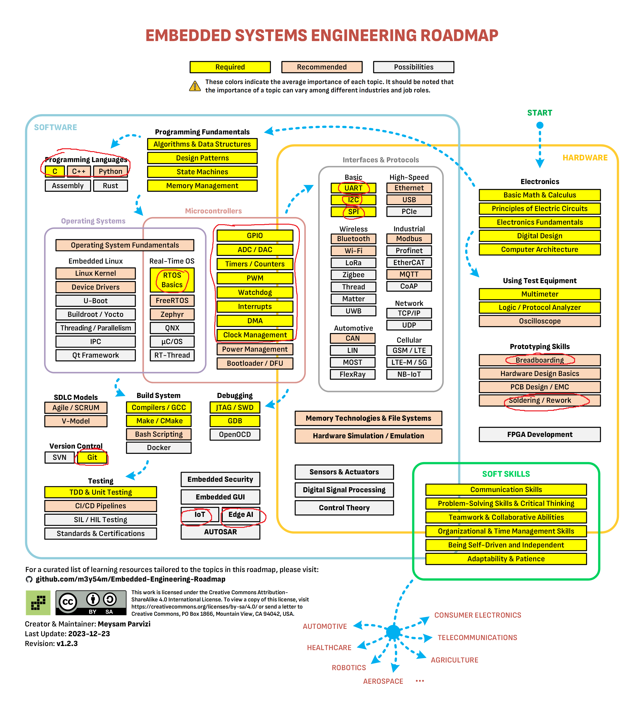
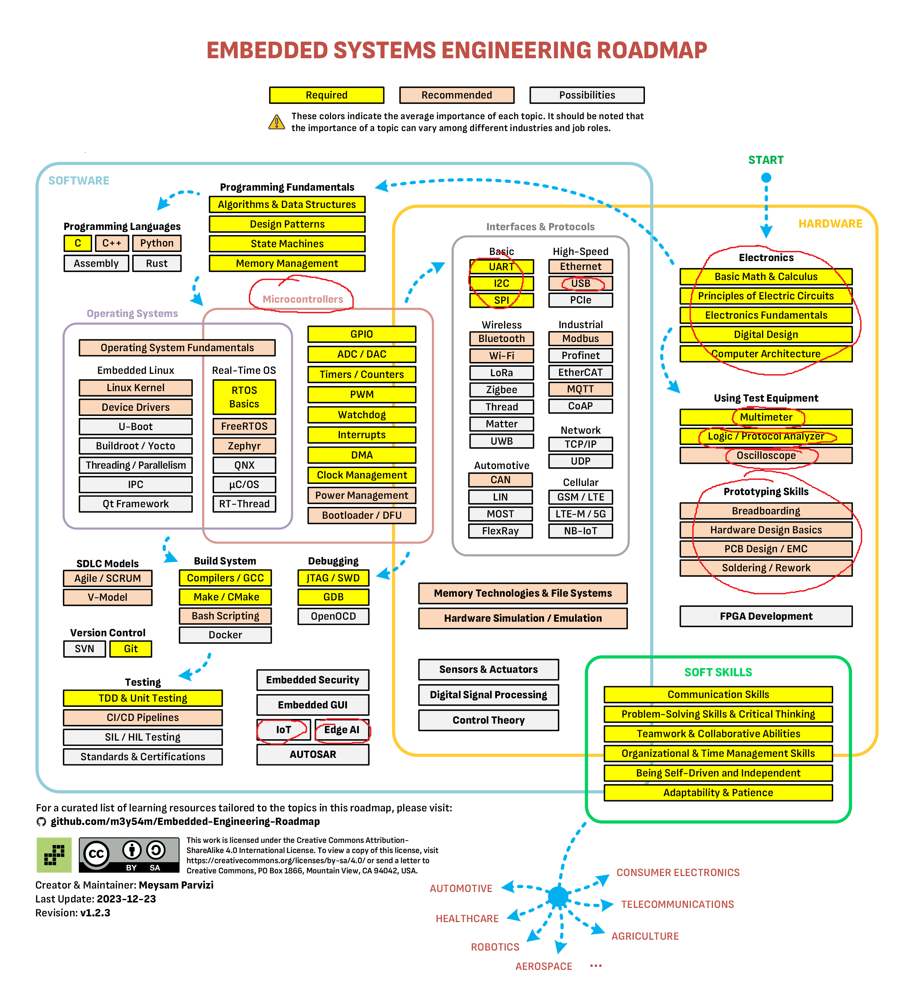

# Phụ lục: Sơ đồ kỹ năng ngành nhúng

Ba sơ đồ này cho bạn nhìn toàn cảnh ngành lập trình nhúng, và thấy nền mình đang học nằm ở đâu trong bức tranh đó.

**Đây là tài liệu tra cứu, không phải lộ trình học.** Nếu bạn mới vào, đừng bắt đầu từ đây — bắt đầu ở [Bạn đang ở đâu](00-ban-dang-o-dau.md). Nhìn vào một bức tường 150 ô chữ khi chưa có nền thì chỉ thấy choáng, không thấy đường.

---

## Cách đọc

Sơ đồ có **hai lớp ký hiệu chồng lên nhau**, đừng nhầm:

**Lớp 1 — màu nền, của tác giả gốc.** Mức độ quan trọng trung bình của chủ đề đó trong toàn ngành nhúng nói chung:

- 🟨 **Vàng** — Required: gần như công việc nhúng nào cũng cần
- 🟧 **Cam** — Recommended: nên biết, tuỳ ngành
- ⬜ **Xám** — Possibilities: chuyên sâu hoặc chỉ dùng ở một số lĩnh vực

**Lớp 2 — khoanh đỏ, của CLB.** Phần CLB chọn ra cho từng nền cụ thể.

> **Khi hai lớp mâu thuẫn, ưu tiên khoanh đỏ.** Một ô màu vàng nhưng không được khoanh nghĩa là quan trọng trong ngành nói chung nhưng chưa cần cho việc CLB đang làm. Một ô màu xám mà được khoanh nghĩa là CLB cần nó, dù ngành nói chung coi là chuyên sâu.

---

## Sơ đồ theo từng nền

### Firmware STM32

Khoanh đỏ tập trung vào khối vi điều khiển và giao tiếp cơ bản — đúng những gì liệt kê trong [nen-stm32.md](nen-stm32.md).

### ESP32 & Kết nối

So với sơ đồ STM32, phần khoanh đỏ mở rộng sang mạng: Wi-Fi, TCP/IP, UDP, MQTT và nhóm mạng di động. Đổi lại, một số ngoại vi của vi điều khiển không được nhấn mạnh — chi tiết ở [nen-esp32.md](nen-esp32.md).

### Hardware

Khoanh đỏ tập trung vào khối Electronics và thiết bị đo.

> **Lưu ý khi dùng sơ đồ này:** [nen-hardware.md](nen-hardware.md) có thêm một số nội dung **không được khoanh trong ảnh** nhưng vẫn bắt buộc với CLB — đặc biệt là **PCB Design / EMC**, **Soldering / Rework**, **Breadboarding**, **Hardware Design Basics**, cùng hai dụng cụ đo **Oscilloscope** và **Logic / Protocol Analyzer**.
>
> Khi hai tài liệu khác nhau, **lấy theo file nền**, không lấy theo ảnh.

---

## Ghi công và giấy phép

Ba sơ đồ trên là bản có chú thích thêm, dựa trên tác phẩm gốc:

> **Embedded Systems Engineering Roadmap**
> Tác giả: **Meysam Parvizi**
> Bản gốc: https://github.com/m3y54m/Embedded-Engineering-Roadmap
> Phiên bản v1.2.3, cập nhật 23/12/2023
> Giấy phép: [Creative Commons Attribution-ShareAlike 4.0 International (CC BY-SA 4.0)](https://creativecommons.org/licenses/by-sa/4.0/)

**Thay đổi so với bản gốc:** UTT UAV Club đã thêm phần khoanh đỏ để đánh dấu các chủ đề tương ứng với từng nền của CLB. Nội dung, bố cục và màu sắc gốc được giữ nguyên.

Theo điều khoản ShareAlike của giấy phép, ba ảnh có chú thích này cũng được phát hành theo **CC BY-SA 4.0**. Bạn được quyền dùng lại và sửa đổi, với điều kiện ghi công tác giả gốc và giữ nguyên giấy phép cho bản phái sinh của bạn.

*Phần tài liệu còn lại trong repo này do UTT UAV Club tự viết và không thuộc phạm vi giấy phép trên.*
